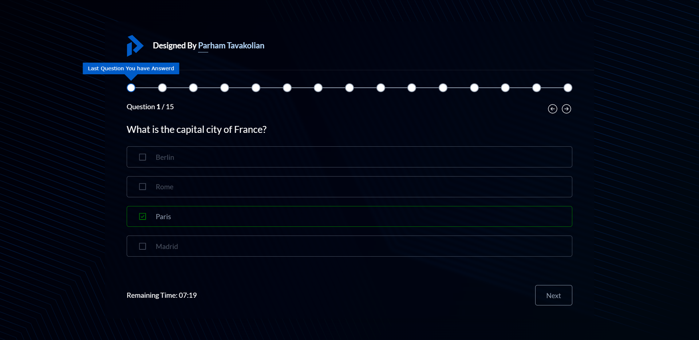

# Quiz App with React

This Quiz application is a dynamic and interactive web-based quiz platform developed using React and SCSS. It allows users to participate in quizzes with real-time data fetched from an API. The application features a user-friendly interface, a form for initial user input, a progress bar for tracking quiz progress, and a results page displaying the user's score. Users also have the option to restart the quiz and modify their selected answers.

## Table of contents

- [Overview](#overview)
  - [Key Features](#features)
  - [Screenshot](#screenshot)
  - [Links](#links)
- [My process](#my-process)
  - [Built with](#built-with)
- [Author](#author)

## Overview

### Features

- Quiz Form: Users can fill out a form to provide necessary information before starting the quiz.
- Real-Time Data: The quiz questions and options are fetched dynamically from an API, ensuring up-to-date and diverse content.
- Interactive Quiz: Users can navigate through the quiz using a professional progress bar or go back and forward buttons.
- Answer Modification: Users can change their chosen options for questions if they wish to revise their answers.
- Results Display: At the end of the quiz, users are presented with their score and can see how well they performed.
- Restart Quiz: Users have the option to restart the quiz and retake it from the beginning.

### Screenshot

### Links

- Live on: [Github Pages](https://frontendparham.github.io/quiz-app/)

## My process

### Built with

- React: The application is built using React, a popular JavaScript library for building user interfaces.
- SCSS: Styling is done using SCSS (Sass), a CSS preprocessor that enhances the styling capabilities with variables, nesting, and more.
- API Integration: The application fetches quiz questions and options from an API to provide dynamic content.

## Author

- Linkedin - [@parham-tavakolian](https://www.linkedin.com/in/parham-tavakolian/)
